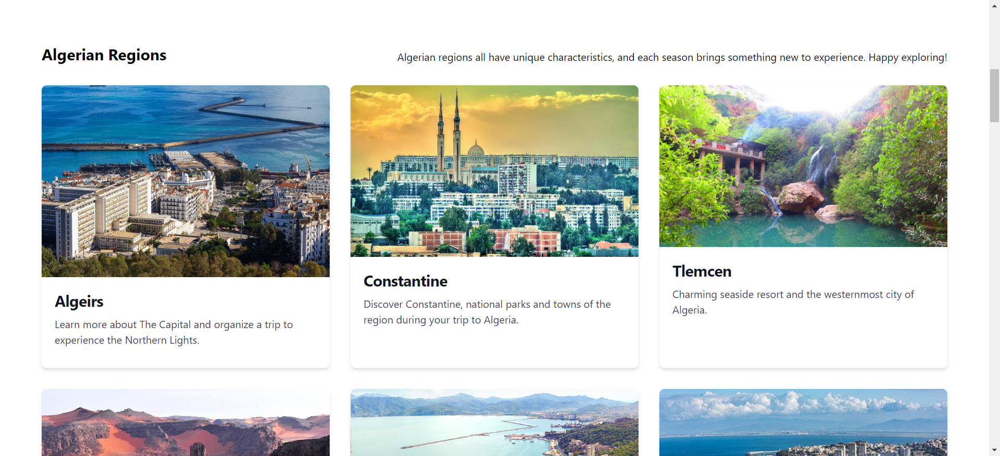

Description du projet :

AlgeriaTourTrip est une application web conçue pour promouvoir le tourisme en Algérie. Elle offre aux utilisateurs des informations sur diverses destinations touristiques, sites culturels, hôtels, restaurants, et autres. L'application vise à encourager le tourisme, tant domestique qu'international, en mettant en valeur la beauté et la diversité de l'Algérie.

Objectifs :

Créer une plateforme engageante et informative qui met en avant les attractions touristiques de l'Algérie.
Fournir aux utilisateurs des informations détaillées sur les lieux d'intérêt, les hébergements, les options de restauration, et les activités.
Encourager le contenu généré par les utilisateurs, comme les avis et les évaluations.
Permettre aux utilisateurs de planifier leurs voyages et d'explorer les merveilles culturelles et naturelles de l'Algérie.
Public cible :

Les touristes planifiant une visite en Algérie.
Les passionnés de voyage intéressés par la découverte des attractions uniques de l'Algérie.
Les voyageurs d'affaires cherchant des hébergements et des options de restauration.
Les résidents algériens à la recherche d'informations sur le tourisme local.
Stack technologique :

UI / UX : Figma
Frontend : React.js
Backend : Node.js
Base de données : MongoDB
Authentification : JSON Web Tokens (JWT)
